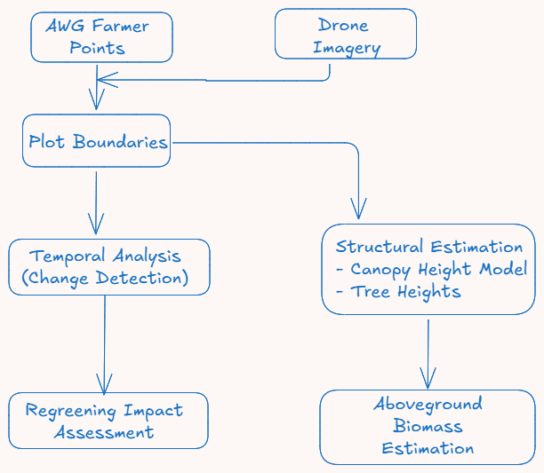

# Africa Wood Grow Regreening Impact Assessment

## Overview

This project was developed to answer a fundamental question for AWG:

> **Is regreening real, or is it imagined?**

To address this, a complete geospatial analysis system was built—spanning **data cleaning, spatial reconstruction, temporal satellite analysis, and ecological modeling**.

The outcome is a reproducible pipeline that quantifies vegetation recovery over time and compares **intervention plots (treatment)** against **non-intervention areas (control)**.

---

## Project Architecture



This system is composed of multiple pipelines that transform raw, inconsistent data into **defensible environmental insights**.

---

## Project Structure

The repository is modular, with each pipeline independently documented and orchestrated by a central flow script.

```text
.
├── data/               # Ignored by git. Ensure raw imagery and external DSM/DTM are placed here.
│   ├── processed/
│   ├── raw/
│   └── shapes/
├── logs/               # Pipeline execution logs
├── pipelines/          # Core geospatial processing modules
│   ├── biomass/
│   ├── change_detection/
│   ├── classification/
│   ├── indices/
│   ├── names_cleaning/
│   ├── preprocessing/
│   ├── training_samples_merger/
│   └── tree_height/
├── shared/             # Common utility functions
│   └── utils/
├── .gitignore          
├── flow_pipeline.py    # Orchestrates the execution order of the sub-pipelines
├── logging_config.py   # Standardized logging setup
├── main.py             # Primary entry point
├── params.yaml         # Central configuration (thresholds, years, bands)
└── requirements.txt    # Dependency list for reproducibility
```

---

## Problem Context

The initial dataset had critical limitations:

- Farm locations existed only as **points**, with no boundaries  
- Farmer names were **inconsistent, duplicated, and unreliable**  
- No structured system existed for tracking or analyzing environmental impact  

Before any analysis, the system had to establish:

1. **Where farms actually are (boundaries)**
2. **Who owns them (clean records)**
3. **What has changed over time (satellite analysis)**

---

## Workflow Summary

### 1. Data Cleaning & Boundary Creation

- Farmer names were cleaned, normalized, and consolidated into a single source of truth
- Farm boundaries were digitized from high-resolution drone imagery
- Output: validated plot polygons with consistent farmer identifiers

---

### 2. Baseline & Change Detection Analysis

To understand regreening, a **baseline year (2010)** was established to represent conditions before intervention.

#### Data Used:

- **2010, 2015** → Landsat imagery  
- **2020, 2025** → Sentinel-2 imagery  

To ensure comparability:

- All imagery was **harmonized to Landsat resolution**

#### Process:

- Training samples were created using Google Earth Pro  
- Samples were merged per **year and land cover class**  
- A **Random Forest classifier** was trained for each year  
- Land cover maps were generated for:
  - 2010
  - 2015
  - 2020
  - 2025  

The classified `.tif` outputs together with vegetation indices and rainfall trends were then analyzed in a notebook to:

- Assess **overall vegetation trends** across the study area 
- Compare **intervention plots vs control areas**  

#### Output:

- Charts and graphs showing vegetation trends  
- Statistical comparison between treatment and control  
- A report demonstrating whether regreening is measurable  

---

### 3. Canopy Height Modeling (CHM)

To assess structural vegetation changes:

- **DSM (Digital Surface Model)** and **DTM (Digital Terrain Model)** are utilized. 
- *Note: Due to file size limitations, DSM and DTM rasters are not tracked in version control. They must be downloaded externally and placed in `data/raw/` prior to execution.*
- CHM is computed as: $CHM = DSM - DTM$
- CHM rasters are then clipped to the validated farm plot boundaries.

---

### 4. Tree Height Metrics Extraction

Using CHM and plot polygons:

- A canopy mask was applied (threshold defined in `params.yaml`)
- Per-plot statistics were extracted:

  - Maximum height  
  - Minimum height  
  - Mean height  
  - Median height  
  - 95th percentile height  
  - Standard deviation  
  - Canopy area  
  - Canopy percentage  

#### Output:

A shapefile containing:

- Farmer name  
- Trees given
- Trees alive
- Species
- Plot geometry  
- Tree height metrics  

---

### 5. Biomass Estimation

Tree height metrics were used to estimate **aboveground biomass** using two established allometric models:

- Chave equation  
- Kuyah equation  

This dual-model approach provides:

- Cross-validation of results  
- Insight into model sensitivity  

#### Output:

- Biomass estimates per plot  
- Comparative results across models  

---

## Outputs

The system produces:

- Cleaned and validated farm boundaries  
- Multi-year land cover classifications
- Regreening trend analysis (charts, graphs, reports)  
- CHM rasters and tree height metrics  
- Biomass estimates using multiple models  

These outputs support both:

- **Technical validation**
- **Stakeholder decision-making**

---

## Configuration

All key parameters are defined in: `params.yaml`

Examples include:

- Canopy height threshold  
- Years of analysis  
- Classification settings 
- Indices target bands 

This ensures flexibility and reproducibility.

---

## ▶️ Running the Project

1. Set up the environment:
It is highly recommended to use a virtual environment.

   ```bash
    python -m venv venv
    source venv/bin/activate  # On Windows use: venv\Scripts\activate
    pip install -r requirements.txt
2. Configure `params.yaml` as needed
3. Run the pipeline

   ```bash
   python main.py
4. Outputs will be generated in the specified directories